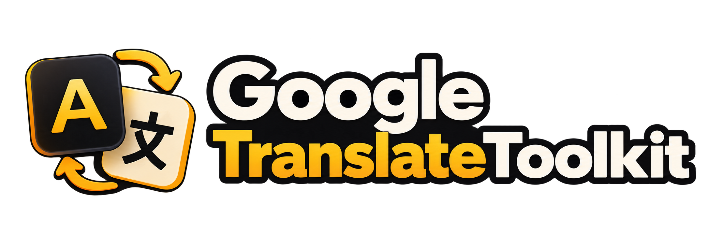

<p align="center">
    
</p>

# GoogleTranslateToolkit

Google Translate for Laravel — a fluent builder, a cache that keeps most translations from ever leaving your server, placeholders that survive the round trip, and a price you can check before you spend it.

[](https://packagist.org/packages/gabrielesbaiz/google-translate-toolkit)
[](composer.json)
[](composer.json)
[](https://packagist.org/packages/gabrielesbaiz/google-translate-toolkit)
[](https://github.com/gabrielesbaiz/google-translate-toolkit/stargazers)
[](https://github.com/sponsors/gabrielesbaiz)

### 📖 [Read the documentation →](https://gabrielesbaiz.github.io/google-translate-toolkit/)

Every configuration key, all eight artisan commands, the caching and cost model,
and recipes for the shapes this package was built for.

> [!CAUTION]
> **Upgrading from 1.x?** Read [UPGRADING.md](UPGRADING.md) first. Your calls keep
> working and the published 1.x config is still read, but `@translate($text, 'it')`
> used to translate **from** Italian and now translates **to** it, and
> `unlessLanguageIs()` always returns a `Translation`. Two changes need an edit.

> [!IMPORTANT]
> A ⭐ costs you nothing and helps other developers find this package.
> [Sponsoring](https://github.com/sponsors/gabrielesbaiz) keeps it compatible
> with every new Laravel release.

## What it does

Calling the Cloud Translation API is three endpoints' worth of work. Everything
hard about translating in a real application happens around that call, and that
is what this package is:

- **A cache that is the point.** Cached segments never reach the API, and a batch only sends what it has not seen before.
- **Placeholders that come back intact.** Ten patterns are masked before the call and restored after: `:name`, `{count}`, `{{ $blade }}`, `%s`, URLs, e-mails, handles and code spans.
- **A glossary**, for brand names that are never translated and domain wording forced per locale.
- **Cost you can see first.** `estimate()` prices a call before it happens, a daily character budget throws rather than bills, and `translate:stats` reports the hit rate behind both.
- **137 languages** as a typed enum, nine of them right to left, plus an Eloquent concern and a testing fake with assertions.

Built on Laravel's own HTTP client — no Google SDK, no gRPC — so `Http::fake()`,
`Http::pool()` and every retry helper you already know work here unchanged.

## Requirements

- PHP 8.3+
- Laravel 12 or 13
- A Google Cloud API key with the Cloud Translation API enabled

## Installation

```bash
composer require gabrielesbaiz/google-translate-toolkit

php artisan vendor:publish --tag="google-translate-toolkit-config"

php artisan translate:text "Hello world" --to=it
```

Set `GOOGLE_TRANSLATE_API_KEY` in your `.env` and the service provider does the
rest: no migrations, no tables, no published assets. Publishing the config is
optional — the defaults translate untouched.

**[Full installation guide →](https://gabrielesbaiz.github.io/google-translate-toolkit/#/install)**

```php
use Gabrielesbaiz\GoogleTranslateToolkit\Facades\GoogleTranslate;

GoogleTranslate::justTranslate('The message bounced');
GoogleTranslate::from('en')->to('it')->asHtml()->text($post->body);
GoogleTranslate::to(['it', 'fr', 'de'])->translate('Good morning');
```

## Artisan commands

| Command | Purpose |
|---|---|
| `translate:text` | Translate strings from the console. `--dry-run` prices them instead. |
| `translate:lang` | Translate `lang/{from}` into other locales, skipping existing lines. |
| `translate:model` | Backfill a model's translated columns, chunked or queued. |
| `translate:cost` | Price a translation before spending a character. |

Eight in all. See the
[commands page](https://gabrielesbaiz.github.io/google-translate-toolkit/#/commands).

## Documentation

| | |
|---|---|
| [Documentation site](https://gabrielesbaiz.github.io/google-translate-toolkit/) | Everything: install, configure, operate. |
| [Configuration](https://gabrielesbaiz.github.io/google-translate-toolkit/#/config) | Every key, and why it exists. |
| [Caching & cost](https://gabrielesbaiz.github.io/google-translate-toolkit/#/cache) | How a batch is split, and how not to be surprised by the bill. |
| [All methods](https://gabrielesbaiz.github.io/google-translate-toolkit/#/api) | The full API surface in one page. |
| [Recipes](https://gabrielesbaiz.github.io/google-translate-toolkit/#/recipes) | Webhooks, lang files, API resources, nightly backfills. |
| [UPGRADING.md](UPGRADING.md) | Upgrading from 1.x. Read before you start. |
| [CHANGELOG.md](CHANGELOG.md) | What changed, and when. |

## Testing

```bash
composer test        # Pest — 94 tests
composer analyse     # PHPStan level 6
composer format      # Pint
```

Those three commands are the contract. The suite runs entirely on `Http::fake()`
with stray requests blocked, so it never reaches Google.

## Contributing

Thank you for considering contributing. Keep the three commands above green and
your pull request will be read quickly.

## Security vulnerabilities

Please review [our security policy](https://github.com/gabrielesbaiz/google-translate-toolkit/security/policy)
for reporting a vulnerability. Please do not open a public issue.

## Credits

Written and maintained by [Gabriele Sbaiz](https://github.com/gabrielesbaiz).

The 1.x line began as a fork of
[JoggApp/laravel-google-translate](https://github.com/JoggApp/laravel-google-translate);
2.0 is a rewrite, and the debt is gladly acknowledged. This package builds on
Laravel and [spatie/laravel-package-tools](https://github.com/spatie/laravel-package-tools).

## Support this package

If it is useful to you:

- ⭐ **Star the repo.** Free, thirty seconds, and it is the first signal other developers look at.
- ❤️ **[Become a sponsor](https://github.com/sponsors/gabrielesbaiz).** From $5 a month.
- 🐛 **Open a good issue.** A clear reproduction is worth more than you think.
- 🗣️ **Tell another Laravel developer.** Word of mouth is how packages survive.

[](https://github.com/sponsors/gabrielesbaiz)

## Disclaimer

This package is provided **as is**, without warranty of any kind, express or
implied, including but not limited to the warranties of merchantability,
fitness for a particular purpose, title and non-infringement. To the fullest
extent permitted by applicable law, in no event shall the authors, copyright
holders or contributors be liable for any claim, damages or other liability —
whether in an action of contract, tort or otherwise — arising from, out of or in
connection with this package or its use, including without limitation any
direct, indirect, incidental, special, exemplary, consequential or punitive
damages, loss of data, loss of profits, business interruption, or unexpected
charges from a third-party API.

This package sends your text to Google. Whoever deploys it is responsible for
deciding whether that is acceptable for the data in question, and for meeting
whatever regulatory, contractual or privacy obligations apply to it — personal
data, confidential business information and anything covered by the GDPR among
them. Machine translation is not a substitute for a professional translator
where accuracy carries legal or safety consequences, and an estimate is an
estimate: the authoritative figure is the one on your Google Cloud invoice.
Nothing here constitutes legal, compliance or security advice.

Use of this package is entirely at your own risk.

## License

MIT. See [LICENSE.md](LICENSE.md). The MIT licence's warranty disclaimer and
limitation of liability apply in full, alongside the disclaimer above.
